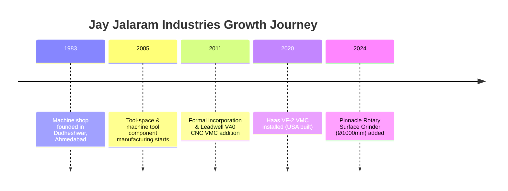

# Company Profile: Jay Jalaram Industries

## 1. Overview & History
**Jay Jalaram Industries** is a leading precision component manufacturer based in Dudheshwar, Ahmedabad, Gujarat. Established in **1983** and formally incorporated in **2011**, the company operates as a proprietorship with a dedicated team of **10 highly skilled machinists and inspectors**.

For over four decades, Jay Jalaram Industries has specialized in sub-contract precision machining, tool-space component manufacturing, and custom machine tool assemblies.

---

## 2. Business Information & Contact Details

| Parameter | Details |
| :--- | :--- |
| **Legal Entity Name** | Jay Jalaram Industries |
| **Business Type** | Proprietorship |
| **Established** | 1983 |
| **Incorporated** | 2011 |
| **Employee Strength** | 10 Skilled Team Members |
| **Core Specialization** | Precision Turned Parts, CNC Milling, Gear Cutting, Rotary & Cylindrical Grinding |
| **Primary Email** | `jayjalaramindustries@gmail.com` |
| **Landline** | `079-25627908` |
| **Factory Address** | I-9, Ravi Estate, Nr. Torrent Power Sub Station, Dudheshwar Road, Dudheshwar, Ahmedabad — 380004, Gujarat, India |

### Management Contacts
- **Vasantbhai S. Panchal**: `+91 9898605252`
- **Viralbhai P. Panchal**: `+91 9558822639`

---

## 3. Milestones & Historical Growth

- **1983**: Founded in Dudheshwar, starting operations with conventional machining.
- **2005**: Expanded into high-precision tool-space components and custom machinery parts.
- **2011**: Corporate incorporation and acquisition of Leadwell V40 CNC milling centre.
- **2020**: Expanded CNC envelope by adding a US-built Haas VF-2 vertical machining centre.
- **2024**: Integrated rotary surface grinding capabilities with a Ø1000 × 200 mm Pinnacle grinder.

---

## 4. Core Values & Guiding Principles

1. **Commitment**: End-to-end ownership of every job from initial cutting to final inspection.
2. **Customer Value**: Honest, competitive pricing delivered strictly to customer tolerances.
3. **Teamwork**: Direct collaboration between skilled machinists and quality control inspectors on the floor.
4. **Professionalism**: Documented setups, repeatable processes, and full dimensional traceability.
5. **Flexibility**: Complete adaptability for build-to-print single prototypes or high-volume repeat production runs.
6. **Social Responsibility**: Safe work environment, environmental consciousness, and responsible waste management.

---

## 5. Major Client Roster

Jay Jalaram Industries serves leading engineering and manufacturing firms across India:

- **Harsha Engineering Ltd.** — Ahmedabad, Gujarat
- **Samarpan Fabricator Ltd.** — Vadodara, Gujarat
- **CPS Cash Processing Solution Pvt. Ltd.** — Haryana
- **Aastha Tools Pvt. Ltd.** — Ahmedabad, Gujarat
- **Pal Shell Cast Pvt. Ltd.** — Ahmedabad, Gujarat
- **Pooja Plast Pvt. Ltd.** — Ahmedabad, Gujarat
