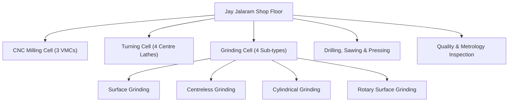

# Machinery & Floor Capabilities: Jay Jalaram Industries

Jay Jalaram Industries maintains a 20+ machine shop floor in Dudheshwar, Ahmedabad. The shop floor is configured into specialized cells for CNC milling, turning, 4 types of grinding, and dedicated quality inspection.

---

## Shop Floor Machinery Breakdown

### 1. CNC Vertical Machining Centres (VMC)
| Machine Model | Origin | Travel Envelope (X × Y × Z) | Year Installed |
| :--- | :--- | :--- | :--- |
| **Leadwell V40** | Taiwan | 1000 × 500 × 500 mm | 2011 |
| **Haas VF-2** | USA | 762 × 508 × 405 mm | 2020 |
| **BFW HSTC3035** | India (Bangalore) | 300 × 300 × 300 mm | 2008 |

### 2. Conventional Lathes & Turning Units
| Brand / Make | Origin | Specification | Units Count | Year Installed |
| :--- | :--- | :--- | :--- | :--- |
| **Honest** | Rajkot | 4.5" Centre Lathe | 2 | 2008, 2009 |
| **Orient** | Rajkot | 4.5" Centre Lathe | 2 | 2008, 2011 |

### 3. Surface & Flat Grinding Machines
| Brand / Make | Origin | Capacity / Table Size | Year Installed |
| :--- | :--- | :--- | :--- |
| **Solar** | Rajkot | 18" × 8" Table | 2007 |
| **TOS (Hydraulic)** | Czechoslovakia | 24" × 8" Table | Legacy |

### 4. Centreless Grinding Machines
| Brand / Make | Origin | Bar Diameter Capacity | Year Installed |
| :--- | :--- | :--- | :--- |
| **Solar** | Rajkot | 3" Capacity | 2008 |
| **Laxman Kadava** | Rajkot | 2" Capacity | 2011 |
| **TOS (Hydraulic Dressing)** | Czechoslovakia | 1" Capacity | Legacy |

### 5. Cylindrical & Rotary Grinding Machines
| Category | Brand / Make | Capacity / Dimensions | Year Installed |
| :--- | :--- | :--- | :--- |
| **Cylindrical Grinder** | John Shipman (England) | 3" × 12" Capacity | Legacy |
| **Rotary Surface Grinder** | Pinnacle | Ø1000 × 200 mm | 2024 |

### 6. Conventional Milling, Drilling & Support Machinery
- **Conventional Milling**: 3 units of Kearney & Trecker semi-automatic vertical milling machines for fixture preparation and secondary slotting operations.
- **Pillar Drilling**: 2 units (3/4" capacity, installed 2007 & 2011).
- **Sawing**: NU-TECH Circular Hacksaw (8" blade).
- **Pressing**: 5 manual hand press units for broaching, shaft straightening, and bushing inserts.

---

## Quality Assurance & Inspection Laboratory

Every production batch manufactured at Jay Jalaram Industries undergoes full dimensional verification on the inspection bay prior to dispatch.

### Metrology & Gauging Equipment
- Precision Granite Surface Inspection Plate.
- Dial Indicator Stand & Height Gauges.
- Micrometers (0-25mm to 150-175mm) and Vernier Calipers.
- Bore Gauges and Thread Plug / Ring Gauges.
- Concentricity alignment blocks and V-blocks for shaft runout checking.
