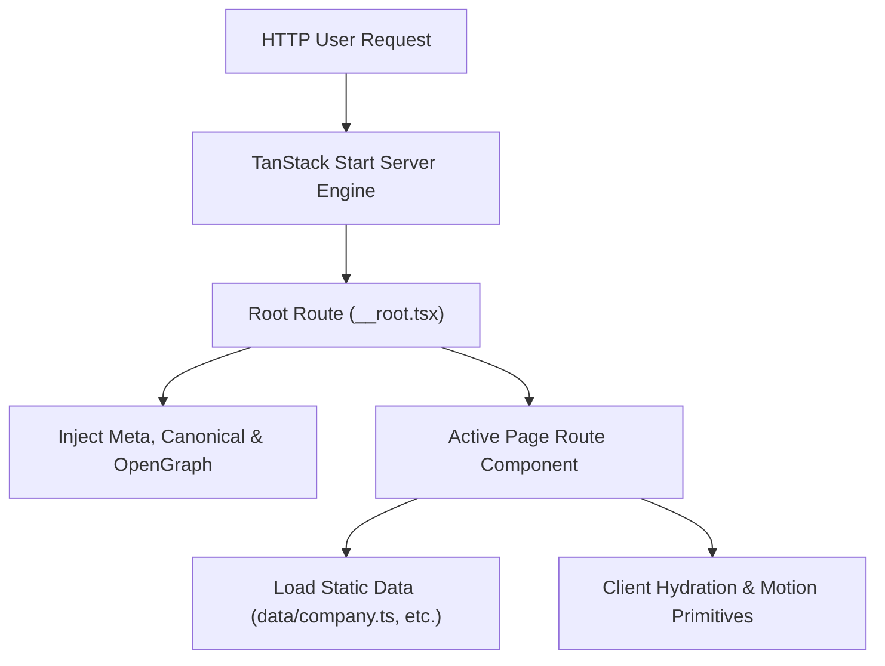

# Technical Architecture: Jay Jalaram Industries Web Platform

This document describes the software design, directory architecture, rendering pipeline, and modern web development stack powering the Jay Jalaram Industries digital platform.

---

## Technical Stack Overview

| Layer | Technology Choice |
| :--- | :--- |
| **Framework & Server** | [TanStack Start](https://tanstack.com/start) with [TanStack Router](https://tanstack.com/router) |
| **UI Library** | React 19 (Concurrent Features, Server Components, Modern Hooks) |
| **Language** | TypeScript (Strict type safety across routes, data, and components) |
| **Styling** | Tailwind CSS v4 + Vanilla CSS Design Tokens (`src/styles.css`) |
| **Build & Bundling** | Vite + Bun Package Manager |
| **SEO & Head Management** | TanStack Router Head Config + Automated Sitemap (`/sitemap.xml`) |

---

## Directory Architecture

```
JJIndustries/
├── .gemini/                 # Agent configuration
├── documents/               # Business & technical documentation
├── public/                  # Static assets & favicon files
├── src/
│   ├── assets/              # Compressed images (products, floor photos)
│   ├── components/          # Reusable UI components
│   │   ├── ui/              # Primitive buttons, dialogs, badges
│   │   └── site/            # Navigation, footer, hero, motion primitives
│   ├── data/                # Static data models (products, machines, company info)
│   │   ├── company.ts       # Corporate metadata, timeline, clients
│   │   ├── machines.ts      # Machine groups and specification details
│   │   └── products.ts      # Product catalog models & image imports
│   ├── hooks/               # Custom React hooks
│   ├── lib/                 # Shared utilities & helper functions
│   ├── routes/              # TanStack Router file-based route definitions
│   │   ├── __root.tsx       # Root layout, navigation bar, footer, SEO head
│   │   ├── index.tsx        # Homepage route (Hero, capabilities summary, stats)
│   │   ├── about.tsx        # About page route (History timeline, floor photos)
│   │   ├── capabilities.tsx # Machine floor detail route
│   │   ├── products.tsx     # Filterable product catalog route
│   │   ├── contact.tsx      # Interactive contact form & map route
│   │   └── sitemap[.]xml.ts # Dynamic sitemap XML route
│   ├── routeTree.gen.ts     # Auto-generated TanStack route tree
│   ├── router.tsx           # Router instantiation & configuration
│   ├── server.ts            # Server entrypoint
│   ├── start.ts             # TanStack Start initialization
│   └── styles.css           # Global CSS variables, animations, and Tailwind directives
├── AGENTS.md                # Security rules & repository guidelines
├── bunfig.toml              # Bun configuration & security release guard
├── package.json             # NPM dependencies & script tasks
├── tsconfig.json            # TypeScript configuration
└── vite.config.ts           # Vite configuration & TanStack Start plugin
```

---

## Routing & SSR Architecture



### Route Structure
1. **`/` (index.tsx)**: Main landing experience showcasing 4 decades of machining excellence, interactive metrics, and capability highlights.
2. **`/about` (about.tsx)**: Company history timeline from 1983 to 2024, core values grid, and shop floor photography.
3. **`/capabilities` (capabilities.tsx)**: Full machine shop inventory breakdown categorized by CNC milling, lathes, and 4 grinding disciplines.
4. **`/products` (products.tsx)**: Interactive category-filtered product gallery (Shafts, Gears, Bushes & Hubs, Rollers, Blocks).
5. **`/contact` (contact.tsx)**: Direct inquiry route with interactive contact cards, map integration, and built-in inquiry submission handler.
6. **`/sitemap.xml` (sitemap[.]xml.ts)**: Dynamic XML sitemap generator for search engine indexing.

---

## Development & Build Workflow

### Local Development Command
```bash
npm run dev
```

### Production Build Command
```bash
npm run build
```

### Type Checking & Code Quality
```bash
npm run build # Performs strict tsc check & route manifest generation
```
